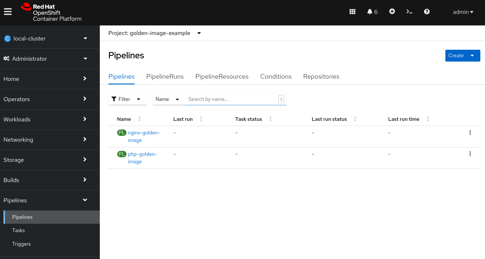
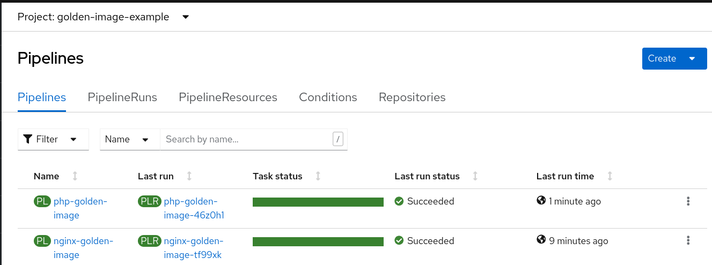
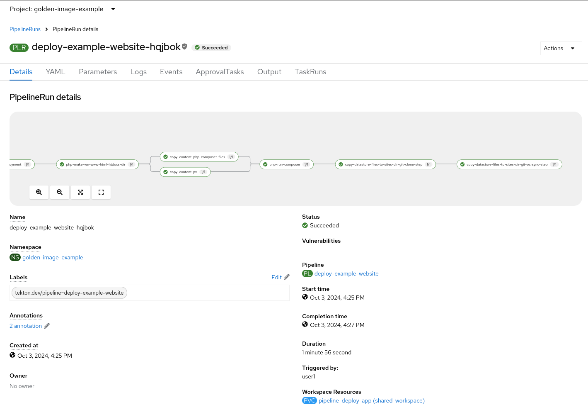

# Example Website

This is a repository for demonstrating the use of multiple OpenShift Tekton Pipelines to create organization specific "golden" images and then deploying an application using these golden images.

## About the Application

This is a simple Nginx PHP-FPM Drupal application based off of: [Edward Monk Test](https://github.com/edwardmonk/test).

## Prerequisites and Assumptions

It's assumed you have:
* An OpenShift 4.10+ cluster deployed with the OpenShift pipelines operator installed
* Sufficient rights to create projects and deploy applications in the OpenShift cluster
* Running this from a Fedora or similar Linux distro
* Installed the OpenShift `oc` utility
* Reasonably comfortable with OpenShift and the Linux command line

## Instructions for deploying with Nginx and PHP-FPM Containers in same pod

1.  Assuming you have already cloned this repository to your local filesystem, you will need to also clone the two repositories for the Nginx and PHP-FPM golden images.

    ```console
    cd ..
    git clone https://github.com/golden-image-example/php.git
    git clone https://github.com/golden-image-example/nginx.git
    cd example-website
    ```

4.  Create a project that you will be deploying in:

    ```console
    oc new-project golden-image-example
    ```

3.  Now create the pipelines for the golden images:

    ```console
    oc create -f ../php/tekton/pipeline.yaml -n golden-image-example
    oc create -f ../nginx/tekton/pipeline.yaml -n golden-image-example
    ```

4.  Log in to the OpenShift web console and navigate to the pipelines for your newly create `golden-image-example` project:

    

5.  Click the 3 dots to the right of the `nginx-golden-image` pipeline:

    

6.  Modify the shared-workspace section to `VolumeClaimTemplate`:

    

7.  Now click `Start`:

    

8.  You will be redirected to the newly created pipeline run:

    

9.  Go back to the left hand section and selection `Pipelines`:

    

10. We're now going to do the same for `php-golden-image`.

    

11. Follow the steps you did for nginx with php, again making sure to select `VolumeClaimTemplate`

    

12. Back in the pipelines section you should see both pipeline successfully build and turn green after a few minutes:

    

13. Now back to the command line! We created a tekton pipeline that has a few custom tasks. So we're going to have to create those tasks first:

    ```console
    oc create -f ./tekton/apply_manifest_task.yaml -n golden-image-example
    oc create -f ./tekton/update_deployment_task.yaml -n golden-image-example
    oc create -f ./tekton/wait_for_deployment_task.yaml -n golden-image-example
    oc create -f ./tekton/oc_rsync_task.yaml -n golden-image-example
    oc create -f ./tekton/oc_exec_task.yaml -n golden-image-example
    ```

14. Now with those tasks created, we're going to create our pipeline for our application that will use our newly created golden "base images" built by the `nginx-golden-image` and `php-golden-image` pipelines.

    ```console
    oc create -f ./tekton/pipeline-single-deployment.yaml -n golden-image-example
    ```

15. Now if we go back to the Pipelines section in the OpenShift web-console, we'll see our newly created `deploy-example-website` pipeline. As before, click the 3 dots to the right and click start:

    

16. Very similarly to the before, modify the **shared-workspace** field to `VolumeClaimTemplate` and click `Start`:

    

17. Now the pipeline should start

    

18. After a time the pipeline should succeed. If you want to, you can watch and explore the progress in the `Logs` tab.

    

19. Now get the URL of the route exposing the nginx container. You can do this via the web or via the command line:

    ```console
    echo https://$(oc get route nginx --template={{.spec.host}})
    ```

20. You should now see a simple html page when you access the root context:

    

21. Modify the url by appending the url with `/index.php` and you should see something similar to the below:

    

# References

* [OpenShift Pipelines Tutorial](https://github.com/openshift/pipelines-tutorial)
* [OpenShift Pipelines Documentation](https://docs.openshift.com/pipelines/1.15/about/about-pipelines.html)